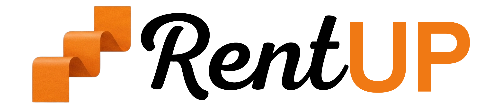

  <picture>
    <source media="(prefers-color-scheme: dark)" srcset="assets/RentUP_Logo_White.png">
    <source media="(prefers-color-scheme: light)" srcset="RentUP_Logo_Dark.png">
    
  </picture>
  
  <h1>RentUP</h1>
  
Modern and efficient property management software.

  

## 🌐 Oficiální web a dokumentace

Navštivte náš oficiální web, kde najdete veškerou dokumentaci a odkazy ke stažení:
👉 **[Oficiální web RentUP](https://xadam1.github.io/RentUP/)**

## 📥 Ke stažení & Aktualizace

Tento repozitář slouží jako oficiální distribuční kanál aplikace RentUP. Všechny stabilní verze a automatické aktualizace jsou zde bezpečně hostovány pomocí [Velopack](https://velopack.io/).

- **Nejnovější verze:** [Stáhnout zde](https://github.com/xadam1/RentUP/releases/latest)
- **Aktualizační kanál:** Spravováno automaticky aplikací.

## 🔐 Bezpečnost & Kill Switch

Pro zajištění maximální bezpečnosti obsahuje RentUP integrovaný systém kontroly verzí. Pokud je vaše aplikace příliš zastaralá nebo probíhá údržba, integrovaný bezpečnostní zámek vás vyzve k aktualizaci.

---
*Poznámka: Zdrojový kód pro RentUP (RentUP-App) je udržován privátně. Tento repozitář (RentUP) slouží výhradně k hostování dokumentace (GitHub Pages), distribuci aktualizací a hlášení chyb.*